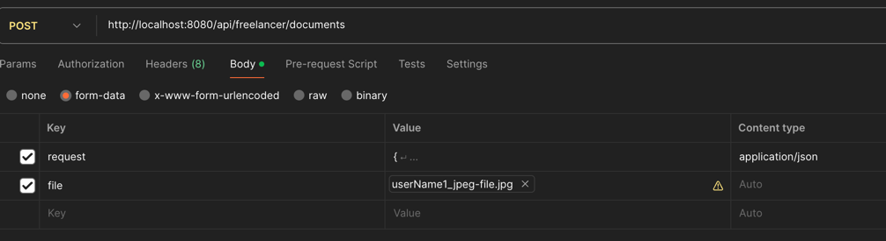

# FreelancerService

It's an API for a freelancer to register him/her and upload his/her documents for verification. 
For every manipulation(create/update/delete) to document, a notification is sent to a freelancer.

## Technologies used:
Technologies used:
* Spring Boot 3.3.2
* Spring Data JPA (Hibernate 6  is the default JPA implementation)
* PostgreSQL 15
* Maven
* Java 17
* JUnit 5
* Docker
* [REST Assured](https://rest-assured.io/) and [Testcontainers](https://testcontainers.com/) (for Spring integration tests using a container)

## Structure
This service consist of 2 modules i.e.
1. freelancer-api
2. freelancer-web

freelancer-api contains Application Programming Interfaces for this service, which is also used to create the swagger documentation of this service.
swagger files are automatically generated by code in JSON and yml format and is stored in "freelancer-api/target/swagger", which can be used by downstream apis or to upload it in documentation repository.
This can be also moved to a separate git repo so that consumers can open Pull request to request their changes. 

freelancer-web is implementing the apis of freelancer-api, and is exposing them as a rest endpoints.

## How to run it
```

$ git clone https://github.com/hitendra1908/freelancer-service.git

$ from the root package run: docker compose up

$ from root package run: mvn clean package

$ and then run: mvn spring-boot:run

```
## How to upload document via postman
POST /api/freelancer/documents can be used to upload a document for freelancer, it needs a request json and a file, which can be passed as shown in below image:

